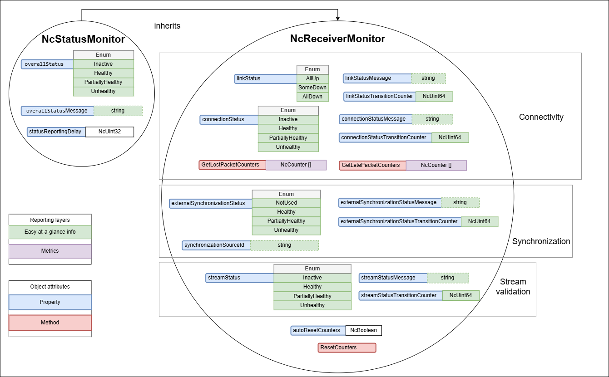
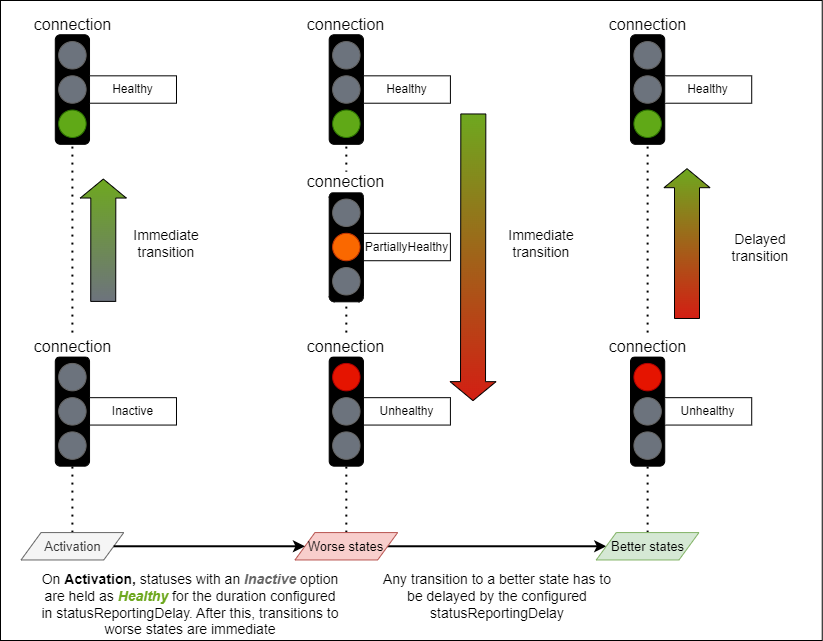
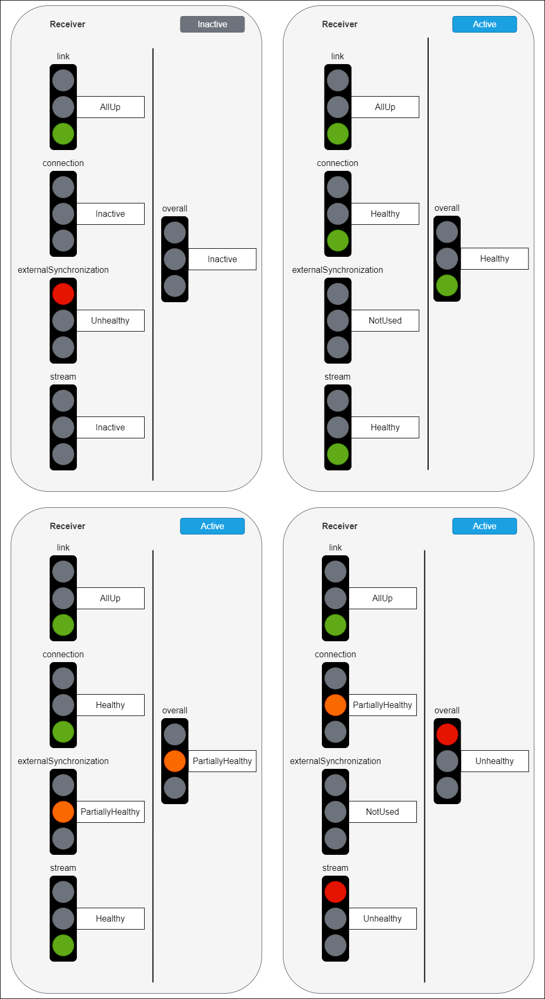
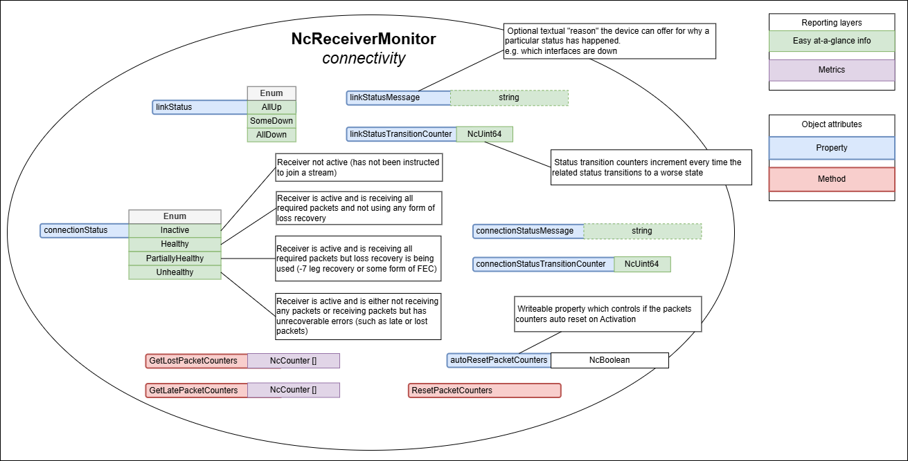
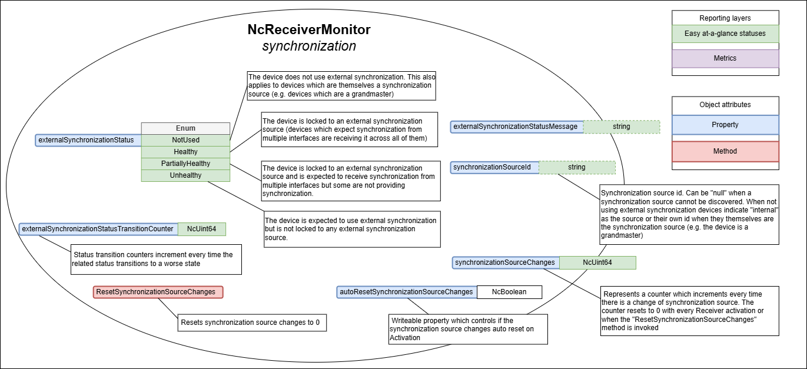
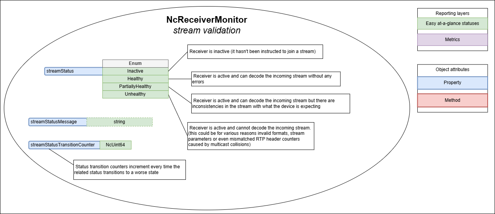
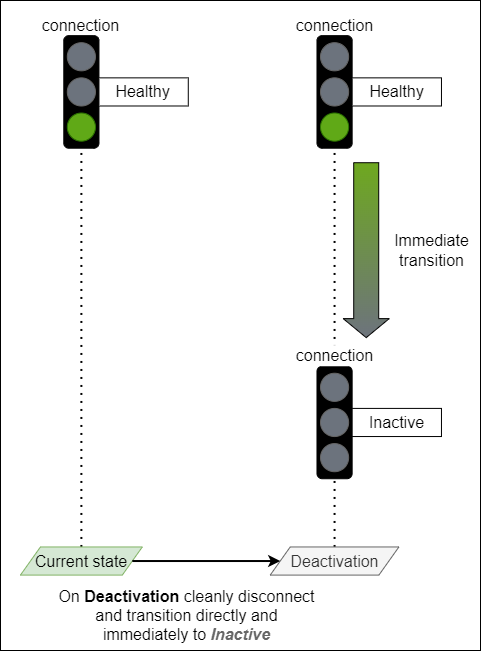

# AMWA BCP-008-01: NMOS Receiver Status Monitoring
{:.no_toc}

* A markdown unordered list which will be replaced with the ToC, excluding the "Contents header" from above
{:toc}

_(c) AMWA 2021, CC Attribution-NoDerivatives 4.0 International (CC BY-ND 4.0)_


## Introduction

Alarms are context and workflow specific, and in general determined by a higher level monitoring system, with different calculations for different users. For example, a hardware error status (such as link down) from a device not actively being used would not cause an alarm to a live workflow operator, but the same status condition would escalate an alarm to a maintenance engineer who needs to prepare that device for future operational use.

This BCP document does not attempt to define alarms but instead it describes the expectations, behavior and conformance requirements for Devices with stream Receivers in terms of status monitoring.

The [overall status](#receiver-overall-status) concepts defined in this document are intended to make it easy to calculate a typical operator alarm condition. In simple systems with no higher level monitoring system, the `overallStatus` can be used directly as a simple pre-defined non-configurable operator alarm condition, without in any way limiting a monitoring system's ability to take the same status values and calculate one or more different alarm conditions appropriate to other desired workflows or users.

This document relies on previous familiarity with the following existing documents:

* [NMOS Control Framework](https://specs.amwa.tv/ms-05-02/)
* [NMOS Control Protocol](https://specs.amwa.tv/is-12/)
* [NMOS Discovery and Registration](https://specs.amwa.tv/is-04/)
* [NMOS Device Connection Management](https://specs.amwa.tv/is-05/)

The technical models referenced in this document are fully published in the [Monitoring NMOS Control Feature Set](https://specs.amwa.tv/nmos-control-feature-sets/branches/main/monitoring/).

The following domains are covered in terms of status monitoring with specific sections for each:

* [Receiver connectivity](#receiver-connectivity)
* [Receiver synchronization](#receiver-synchronization)
* [Receiver stream validation](#receiver-stream-validation)

## Use of Normative Language

The key words "MUST", "MUST NOT", "REQUIRED", "SHALL", "SHALL NOT", "SHOULD", "SHOULD NOT", "RECOMMENDED", "MAY",
and "OPTIONAL" in this document are to be interpreted as described in [RFC-2119](https://datatracker.ietf.org/doc/html/rfc2119).

## Definitions

The NMOS terms 'Controller', 'Node', 'Source', 'Flow', 'Sender', 'Receiver' are used as defined in the [NMOS Glossary](https://specs.amwa.tv/nmos/main/docs/Glossary.html).

Receiver activation - An [IS-05 activation](https://specs.amwa.tv/is-05/latest/docs/Interoperability_-_IS-04.html#identifying-active-connections) which results in the Receiver having the required transport parameters and a `master_enable` status of `true`. This can happen for an idle receiver but also when the receiver is already activated and a client is applying new transport parameters.

## Prerequisites

Devices in conformance to this BCP MUST comply with [NMOS Control Framework](https://specs.amwa.tv/ms-05-02/) for generating device models.  
Devices in conformance to this BCP MUST comply with [NMOS Control Protocol](https://specs.amwa.tv/is-12/) to expose device models via a standard API with full support for notifications.  
Devices in conformance to this BCP MUST comply with [NMOS Discovery and Registration](https://specs.amwa.tv/is-04/) to create, describe and register Nodes, Devices and Receiver resources.  
Devices in conformance to this BCP MUST comply with [NMOS Device Connection Management](https://specs.amwa.tv/is-05/) to perform connection management actions against Receiver resources.  

## Receiver monitoring

The technical model describing the monitoring requirements for a receiver is [NcReceiverMonitor](https://specs.amwa.tv/nmos-control-feature-sets/branches/main/monitoring/#ncreceivermonitor).

This model inherits from the baseline status monitoring model [NcStatusMonitor](https://specs.amwa.tv/nmos-control-feature-sets/branches/main/monitoring/#ncstatusmonitor).

Receiver monitors MUST implement [NcReceiverMonitor](https://specs.amwa.tv/nmos-control-feature-sets/branches/main/monitoring/#ncreceivermonitor) directly or derive a [vendor specific variant from NcReceiverMonitor](https://specs.amwa.tv/ms-05-02/latest/docs/Introduction.html) which MAY add more statuses, properties and methods but MUST still comply with the requirements set out in this specification.

|  |
|:--:|
| _**Receiver monitoring model**_ |

### Receiver status reporting delay

The `statusReportingDelay` property allows clients to customize the reporting delay used by devices to report statuses. Devices MUST use 3s as the default value when the receiver monitor object is first constructed and MUST allow it to be changed to values within the device's published constraints. Devices MUST allow setting the `statusReportingDelay` property to a value of 3s. All domain specific statuses are impacted by the configured `statusReportingDelay` as follows:

* A receiver is expected to go through a period of instability upon activation. Therefore, on Receiver activation domain specific statuses offering an `Inactive` option MUST transition immediately to the Healthy state. Furthermore, after activation, as long as the Receiver isn’t being [deactivated](#deactivating-a-receiver), it MUST delay the reporting of non Healthy states for the duration specified by `statusReportingDelay`, and then transition to any other appropriate state.

* Once any Receiver activation `statusReportingDelay` has elapsed and the Receiver isn't being [deactivated](#deactivating-a-receiver), all domain specific statuses MUST delay the transition to a more healthy state by the configured `statusReportingDelay` value and MUST only make the transition if the healthier state is maintained for the duration. All domain specific statuses MUST make a transition to a less healthy state without delay.

|  |
|:--:|
| _**Status reporting delay example**_ |

### Receiver status transition counters

All receiver specific domain statuses have an associated status transition counter property. These MUST increment each time the associated status transitions to a less healthy state. Transitions to/from neutral states like `Inactive` or `NotUsed` are ignored.

The intention is that these properties store historical negative trend transitions for each status.

The list of all status transition counter properties is:

* linkStatusTransitionCounter
* connectionStatusTransitionCounter
* externalSynchronizationStatusTransitionCounter
* streamStatusTransitionCounter

Devices MUST be able to reset ALL status transition counter properties in the following two ways:

* When a receiver activation occurs if `autoResetCountersAndMessages` is set to `true`
* When a client invokes the `ResetCountersAndMessages` method

The `autoResetCountersAndMessages` property allows clients to configure if ALL counters automatically reset with each Receiver activation (by default devices MUST have this enabled). If this is enabled, receivers MUST reset ALL counters to 0 after each activation. Devices MUST allow setting the `autoResetCountersAndMessages` property to a value of `true` and MAY allow setting the property to `false`. This supports use cases where users do not want to reset automatically after each activation.

### Receiver overall status

The purpose of the overallStatus is to abstract and combine the specific domain statuses of a monitor into a single status which can be more easily observed and displayed by a simple client.

`Note`: The overallStatus might remain the same even when specific domain statuses change. However, the overallStatusMessage might change to indicate that a different combination of internal states is causing the current overallStatus value.

Where possible, Device implementations are RECOMMENDED to populate the overallStatusMessage with the root causes which led to the current PartiallyHealthy or Unhealthy overallStatus.

For example, a number of domain statuses become less healthy when a network interface is down. In this case the overallStatusMessage could report the following root cause

```log
NIC 1 is down
```

Furthermore, where possible Device implementations are RECOMMENDED to retain the previous status message when returning to a Healthy state from a PartiallyHealthy or Unhealthy state by prepending the previous message with "Previously: ".

For example, upon recovery to a healthy state the overallStatusMessage could hold the following value

```log
Previously: NIC 1 is down
```

Devices MUST follow the rules listed below when mapping specific domain statuses in the combined overallStatus:

* When the Receiver is Inactive the overallStatus uses the Inactive option
* When the Receiver is Active the overallStatus takes the least healthy state of all domain statuses (if one status is PartiallyHealthy (or equivalent) and another is Unhealthy (or equivalent) then the overallStatus would be Unhealthy)
* The overallStatus is Healthy only when all domain statuses are either Healthy or a neutral state (e.g. Not used, Inactive)

|  |
|:--:|
| _**Overall status mapping examples**_ |

### Receiver status messages

The overall status and all receiver specific domain statuses have an associated status message property.
The list of all status message properties is:

* overallStatusMessage
* linkStatusMessage
* connectionStatusMessage
* externalSynchronizationStatusMessage
* streamStatusMessage

Resetting status message properties is achieved by assigning a value of `null` to them.

Devices MUST be able to reset ALL status message properties in the following two ways:

* When a receiver activation occurs if `autoResetCountersAndMessages` is set to true
* When a client invokes the `ResetCountersAndMessages` method

The `autoResetCountersAndMessages` property allows clients to configure if ALL status message properties automatically reset with each Receiver activation (by default devices MUST have this enabled). If this is enabled, receivers MUST reset ALL status message properties after each activation. Devices MUST allow setting the `autoResetCountersAndMessages` property to a value of `true` and MAY allow setting the property to `false`. This supports use cases where users do not want to reset automatically after each activation.

### Receiver connectivity

[NcReceiverMonitor](https://specs.amwa.tv/nmos-control-feature-sets/branches/main/monitoring/#ncreceivermonitor) includes the following specific items covering the connectivity domain:

* Properties
  * linkStatus
  * linkStatusMessage
  * linkStatusTransitionCounter
  * connectionStatus
  * connectionStatusMessage
  * connectionStatusTransitionCounter
* Methods
  * GetLostPackets
  * GetLatePackets

|  |
|:--:|
| _**Receiver connectivity (explanatory notes are informative)**_ |

#### Link status

The linkStatus property allows devices to expose the health of all the physical links associated with the receiver.

Devices MUST report the linkStatus as follows:

* AllUp when all of the interfaces are Up (equivalent to a Healthy state)
* SomeDown when some of the interfaces are Down (equivalent to a PartiallyHealthy state)
* AllDown when all interfaces are Down (equivalent to an Unhealthy state)

The linkStatusMessage is a nullable property where devices MAY offer the reason and further details as to why the current status value was chosen.

Devices are RECOMMENDED to publish information about which interfaces are down in the linkStatusMessage.

Example:

```log
NIC1, NIC2 are down
```

Furthermore, where possible Device implementations are RECOMMENDED to retain the previous status message when returning to a Healthy state from a PartiallyHealthy or Unhealthy state by prepending the previous message with "Previously: ".

For example, upon recovery to a healthy state the linkStatusMessage could hold the following value

```log
Previously: NIC1, NIC2 are down
```

#### Connection status

The connectionStatus property allows devices to expose the health of the receiver with regards to receiving stream packets successfully. Other connection problems like 802.1x authorization, DHCP and other causes are also reflected in the connectionStatus.

Devices MUST report the connectionStatus as follows:

* Inactive when the receiver is Inactive (this is a neutral state)
* Healthy when the receiver is Active and receiving all required packets without using any form of loss recovery
* PartiallyHealthy when the receiver is Active and is receiving all required packets but some form of loss recovery is being used (e.g. redundant leg recovery or some form of FEC)
* Unhealthy when the receiver is Active and is either not receiving any packets or receiving packets but has unrecoverable errors (such as late or lost packets)

The connectionStatusMessage is a nullable property where devices MAY offer the reason and further details as to why the current status value was chosen.

Furthermore, where possible Device implementations are RECOMMENDED to retain the previous status message when returning to a Healthy state from a PartiallyHealthy or Unhealthy state by prepending the previous message with "Previously: ".

For example, upon recovery to a healthy state the connectionStatusMessage could hold the following value

```log
Previously: Packet loss detected
```

#### Late and lost packets

The receiver monitoring model provides means of gathering metrics around late and lost stream packets. These are not statuses but instead enable further analysis when [link status](#link-status) or [connection status](#connection-status) indicate problems (are PartiallyHealthy or Unhealthy).

Lost packets are packets that never arrived. Late packets are packets that arrived but arrived too late to be usable by presentation time.

Devices with capabilities to detect late or lost packets MUST implement the following methods:

* GetLostPacketCounters - returns a non empty collection of counters which hold the name, description and numeric value of the counter (this allows more capable devices to report lost packets across different interfaces).
* GetLatePacketCounters - returns a non empty collection of counters which hold the name, description and numeric value of the counter (this allows more capable devices to report late packets across different interfaces).

Devices with capabilities to detect late or lost packets MUST be able to reset ALL lost and late packet counters in the following two ways:

* When a receiver activation occurs if `autoResetCountersAndMessages` is set to `true`
* When a client invokes the `ResetCountersAndMessages` method

For implementations which cannot measure individual late packets the late counters MUST at the very least increment every time the presentation is affected due to late packet arrival.

When devices do not have the capability to detect lost or late packets they MUST:

* Implement the GetLostPacketCounters method but return an empty collection
* Implement the GetLatePacketCounters method but return an empty collection

### Receiver synchronization

[NcReceiverMonitor](https://specs.amwa.tv/nmos-control-feature-sets/branches/main/monitoring/#ncreceivermonitor) includes the following specific items covering the synchronization domain:

* Properties
  * externalSynchronizationStatus
  * externalSynchronizationStatusMessage
  * externalSynchronizationStatusTransitionCounter
  * synchronizationSourceId

|  |
|:--:|
| _**Receiver synchronization (explanatory notes are informative)**_ |

#### External synchronization status

The externalSynchronizationStatus property allows devices to expose the health of the receiver with regards to its synchronization mechanisms.

Devices MUST report the externalSynchronizationStatus as follows:

* NotUsed when the receiver is not intending to use external synchronization or when the device is itself the synchronization source (this is a neutral state)
* Healthy when the receiver is locked to an external synchronization source (devices which expect synchronization from multiple interfaces are receiving it across all of them)
* PartiallyHealthy when the receiver is locked to an external synchronization source and is expected to receive synchronization from multiple interfaces but some are not providing synchronization (Receivers MUST also temporarily transition to this state when detecting a synchronization source change)
* Unhealthy when the receiver is expected to use external synchronization but is not locked to any external synchronization source

The externalSynchronizationStatusMessage is a nullable property where devices MAY offer the reason and further details as to why the current status value was chosen.

Devices are RECOMMENDED to publish in the externalSynchronizationStatusMessage property information about the previous synchronization source and originating interface.

Example:

```log
Source change from: SDI1
```

or

```log
Source change from: 00:0c:ec:ff:fe:0a:2b:a1 on NIC1
```

Furthermore, where possible Device implementations are RECOMMENDED to retain the previous status message when returning to a Healthy state from a PartiallyHealthy or Unhealthy state by prepending the previous message with "Previously: ".

For example, upon recovery to a healthy state the externalSynchronizationStatusMessage could hold the following value

```log
Previously: Source change from: SDI1
```

#### Synchronization source change

When devices intend to use external synchronization they MUST publish the synchronization source id currently being used in the `synchronizationSourceId` property and update the `externalSynchronizationStatus` property whenever it changes, setting the `synchronizationSourceId` to `null` if a synchronization source cannot be discovered. Devices which are not intending to use external synchronization MUST populate this property with `internal` or their own id if they themselves are the synchronization source (e.g. the device is a grandmaster).

Where possible devices are RECOMMENDED to also indicate the interface used in the synchronization source id like in the following examples.

```log
00:0c:ec:ff:fe:0a:2b:a1 on NIC1
```

or

```log
00:1d:ec:ff:fe:0a:2b:b4, Blue
```

or

```log
SDI1
```

or

```log
BlackBurst 1
```

or

```log
WCLK BNC1
```

When devices observe a synchronization source id change the `externalSynchronizationStatus` property MUST temporarily transition to a `PartiallyHealthy` state. It can then return to a different state if the operating conditions match it more closely (returning to a healthier state MUST respect the requirements in the [status reporting delay section](#receiver-status-reporting-delay)). Devices capable of reporting the specific interface used in the synchronization source id MUST follow the previous transition requirement even when the only change observed is the interface now being used for synchronization.

### Receiver stream validation

[NcReceiverMonitor](https://specs.amwa.tv/nmos-control-feature-sets/branches/main/monitoring/#ncreceivermonitor) includes the following specific items covering the stream validation domain:

* Properties
  * streamStatus
  * streamStatusMessage
  * streamStatusTransitionCounter

|  |
|:--:|
| _**Receiver stream validation (explanatory notes are informative)**_ |

#### Stream status

The streamStatus property allows devices to expose the health of the receiver with regards to the validity of the stream being received.

Devices MUST report the streamStatus as follows:

* Inactive when the receiver is Inactive (this is a neutral state)
* Healthy when the receiver is Active and can decode the incoming stream without any detected errors
* PartiallyHealthy when the receiver is Active and can decode the incoming stream but there are inconsistencies in the stream with what the device is expecting
* Unhealthy when the receiver is active and cannot decode the incoming stream

The streamStatusMessage is a nullable property where devices MAY offer the reason and further details as to why the current status value was chosen.

Examples:

```log
Unexpected stream format
```

```log
Payload ID in RTP stream does not match SDP file
```

```log
Parameter X does not match expectations
```

Furthermore, where possible Device implementations are RECOMMENDED to retain the previous status message when returning to a Healthy state from a PartiallyHealthy or Unhealthy state by prepending the previous message with "Previously: ".

For example, upon recovery to a healthy state the streamStatusMessage could hold the following value

```log
Previously: Payload ID in RTP stream does not match SDP file
```

### Deactivating a receiver

A Receiver is deactivated after an [IS-05 activation](https://specs.amwa.tv/is-05/latest/docs/Interoperability_-_IS-04.html#identifying-active-connections) results in the Receiver `master_enable` becoming `false`.

When a receiver is being deactivated it MUST cleanly disconnect from the current stream by not generating intermediate unhealthy states (PartiallyHealthy or Unhealthy) and instead transition directly and immediately (without being delayed by the `statusReportingDelay`) to `Inactive` for the following statuses:

* overallStatus
* connectionStatus
* streamStatus

|  |
|:--:|
| _**Deactivation transition example**_ |

### Touchpoints and IS-04 receivers

Receiver monitors make use of the [Touchpoints](https://specs.amwa.tv/ms-05-02/latest/docs/NcObject.html#touchpoints) mechanism inherited from [NcObject](https://specs.amwa.tv/ms-05-02/latest/docs/NcObject.html) to attach to the correct receiver identity.

The `touchpoints` property of any [NcReceiverMonitor](https://specs.amwa.tv/nmos-control-feature-sets/branches/main/monitoring/#ncreceivermonitor) MUST have one or more touchpoints of which one and only one entry MUST be of type [NcTouchpointNmos](https://specs.amwa.tv/ms-05-02/latest/docs/Framework.html#nctouchpointnmos) where the `resourceType` field MUST be set to "receiver" and the `id` field MUST be set to the associated IS-04 receiver UUID.

Receiver monitors MUST maintain a 1 to 1 relationship between its role and the receiver resource it monitors (expressed via the `touchpoints` property) for the lifetime of the IS-04 receiver resource.

Touchpoints example:

```json
[
  {
    "contextNamespace": "x-nmos",
    "resource": {
      "resourceType": "receiver",
      "id": "82fdc03f-76c7-4989-9d05-3ea2cc98875e"
    }
  }
]
```

### NcWorker inheritance

[NcStatusMonitor](https://specs.amwa.tv/nmos-control-feature-sets/branches/main/monitoring/#ncstatusmonitor) inherits from the [NcWorker](https://specs.amwa.tv/ms-05-02/latest/docs/Framework.html#ncworker) model.

Since [NcReceiverMonitor](https://specs.amwa.tv/nmos-control-feature-sets/branches/main/monitoring/#ncreceivermonitor) inherits from the [NcStatusMonitor](https://specs.amwa.tv/nmos-control-feature-sets/branches/main/monitoring/#ncstatusmonitor) model then it also indirectly inherits from the [NcWorker](https://specs.amwa.tv/ms-05-02/latest/docs/Framework.html#ncworker) model.

In the case of Receiver monitors, the `enabled` property has no operational meaning and MUST NOT be interpreted in any way.

Devices MAY choose to not allow changes to the `enabled` property and instead return `InvalidRequest` to Set method invocations for this property.

## Controller

Controllers MUST be capable to discover receiver monitor objects (objects which implement [NcReceiverMonitor](https://specs.amwa.tv/nmos-control-feature-sets/branches/main/monitoring/#ncreceivermonitor) directly or derive a [vendor specific variant from NcReceiverMonitor](https://specs.amwa.tv/ms-05-02/latest/docs/Introduction.html)) inside a device model and indicate them to the User. All blocks inside an MS-05-02 device allow [searching for members by their class id](https://specs.amwa.tv/ms-05-02/latest/docs/Blocks.html#search-methods).

Controllers MUST be capable to find the associated IS-04 receiver identity for each receiver monitor by using the [touchpoints](#touchpoints-and-is-04-receivers) and indicate this relationship to the User.

Controllers MUST be capable to get the current state of the overallStatus property using the [Get method](https://specs.amwa.tv/ms-05-02/latest/docs/NcObject.html#generic-getter-and-setter) and indicate this to the User.

Controllers MUST be capable of tracking changes to the overallStatus property by using [subscriptions and notifications](https://specs.amwa.tv/is-12/latest/docs/Protocol_messaging.html#notification-message-type) and reflect these changes to the User.

Controllers MUST be capable to get the current state of the following status properties using the [Get method](https://specs.amwa.tv/ms-05-02/latest/docs/NcObject.html#generic-getter-and-setter) and indicate them to the User:

* linkStatus
* connectionStatus
* externalSynchronizationStatus
* streamStatus

Controllers MUST be capable of tracking changes to the following status properties by using [subscriptions and notifications](https://specs.amwa.tv/is-12/latest/docs/Protocol_messaging.html#notification-message-type) and reflect these changes to the User:

* linkStatus
* connectionStatus
* externalSynchronizationStatus
* streamStatus

Controllers MUST be capable of getting the current value of ALL status message properties using the [Get method](https://specs.amwa.tv/ms-05-02/latest/docs/NcObject.html#generic-getter-and-setter) and indicate it to the User.

Controllers MUST be capable of tracking changes to ALL the status message properties by using [subscriptions and notifications](https://specs.amwa.tv/is-12/latest/docs/Protocol_messaging.html#notification-message-type) and reflect these to the User.

Controllers MUST be capable of getting the current value of the synchronizationSourceId using the [Get method](https://specs.amwa.tv/ms-05-02/latest/docs/NcObject.html#generic-getter-and-setter) and indicate it to the User.

Controllers MUST be capable of tracking changes to the synchronizationSourceId property by using [subscriptions and notifications](https://specs.amwa.tv/is-12/latest/docs/Protocol_messaging.html#notification-message-type) and reflect these to the User.

The values of status message properties MUST NOT be interpreted by controllers and are meant to be used verbatim and indicated to the User.

Controllers SHOULD NOT open an excessive number of WebSocket connections against the same control endpoint.

Controllers MUST always use subscriptions and notifications to keep track of changes to any properties of interest and not revert to a polling behaviour.

Controllers MAY be capable of getting the lost packet counters from a device which offers them by invoking the GetLostPacketCounters method using [IS-12 commands](https://specs.amwa.tv/is-12/latest/docs/Protocol_messaging.html#command-message-type) and indicating their value to the User.

Controllers MAY be capable of getting the late packet counters from a device which offers them by invoking the GetLatePacketCounters method using [IS-12 commands](https://specs.amwa.tv/is-12/latest/docs/Protocol_messaging.html#command-message-type) and indicating their value to the User.

Controllers SHOULD NOT resort to a fast pace repetitive polling workflow for getting the lost packets of a device which offers them.

Controllers SHOULD NOT resort to a fast pace repetitive polling workflow for getting the late packets of a device which offers them.

Controllers MAY be capable to invoke the ResetCountersAndMessages method by using [IS-12 commands](https://specs.amwa.tv/is-12/latest/docs/Protocol_messaging.html#command-message-type).

Controllers MAY be capable to set the autoResetCountersAndMessages property using the [Set method](https://specs.amwa.tv/ms-05-02/latest/docs/NcObject.html#generic-getter-and-setter).

Controllers MAY be capable of getting the current value of ANY status transition counter property using the [Get method](https://specs.amwa.tv/ms-05-02/latest/docs/NcObject.html#generic-getter-and-setter) and indicate it to the User.

Controllers MAY be capable of tracking changes to ANY status transition counter property by using [subscriptions and notifications](https://specs.amwa.tv/is-12/latest/docs/Protocol_messaging.html#notification-message-type) and reflect these to the User.

Controllers MAY provide a single indicator to inform the User whenever ANY of the domains have a non zero status transition counter. This single indicator complements the overallStatus by capturing situations where ANY of the domains have experienced issues since their last reset.
