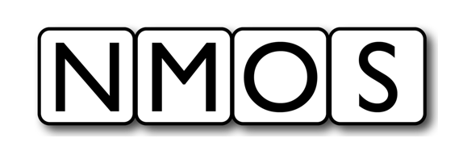

# AMWA BCP-00X-0X: Receiver status monitoring
{:.no_toc}

* A markdown unordered list which will be replaced with the ToC, excluding the "Contents header" from above
{:toc}

_(c) AMWA 2021, CC Attribution-NoDerivatives 4.0 International (CC BY-ND 4.0)_

## Introduction

The aim of this BCP document is to describe the expectations, behaviour and conformance requirements for Devices with stream Receivers in terms of status monitoring.

This document relies on previous familiarity with the following existing documents:

* [NMOS Control Framework](https://specs.amwa.tv/ms-05-02/)
* [NMOS Control Protocol](https://specs.amwa.tv/is-12/)
* [NMOS Discovery and Registration](https://specs.amwa.tv/is-04/)
* [NMOS Device Connection Management](https://specs.amwa.tv/is-05/)

The technical models referenced in this document are fully published in the [Monitoring NMOS Control Feature Set](https://specs.amwa.tv/nmos-control-feature-sets/branches/publish-status-reporting/monitoring/).

The following domains are covered in terms of status monitoring with specific sections for each:

* [Receiver connectivity](#receiver-connectivity)
* [Receiver synchronization](#receiver-synchronization)
* [Receiver stream validation](#receiver-stream-validation)

## Use of Normative Language

The key words "MUST", "MUST NOT", "REQUIRED", "SHALL", "SHALL NOT", "SHOULD", "SHOULD NOT", "RECOMMENDED", "MAY",
and "OPTIONAL" in this document are to be interpreted as described in [RFC 2119][RFC-2119].

## Definitions

The NMOS terms 'Controller', 'Node', 'Source', 'Flow', 'Sender', 'Receiver' are used as defined in the [NMOS Glossary](https://specs.amwa.tv/nmos/main/docs/Glossary.html).

## Prerequisites

Devices in conformance to this BCP MUST use [NMOS Control Framework](https://specs.amwa.tv/ms-05-02/) for generating device models.  
Devices in conformance to this BCP MUST use [NMOS Control Protocol](https://specs.amwa.tv/is-12/) to expose device models via a standard API with full support for notifications.  
Devices in conformance to this BCP MUST use [NMOS Discovery and Registration](https://specs.amwa.tv/is-04/) to create and register Nodes, Devices and Receiver resources.  
Devices in conformance to this BCP MUST use [NMOS Device Connection Management](https://specs.amwa.tv/is-05/) to perform connection management actions against Receiver resources.  

## Receiver overall status

Document overall status model and intention.

## Receiver connectivity

Document models specific to connectivity and behaviour.

## Receiver synchronization

Document models specific to synchronization and behaviour.

## Receiver stream validation

Document models specific to stream validation and behaviour.
