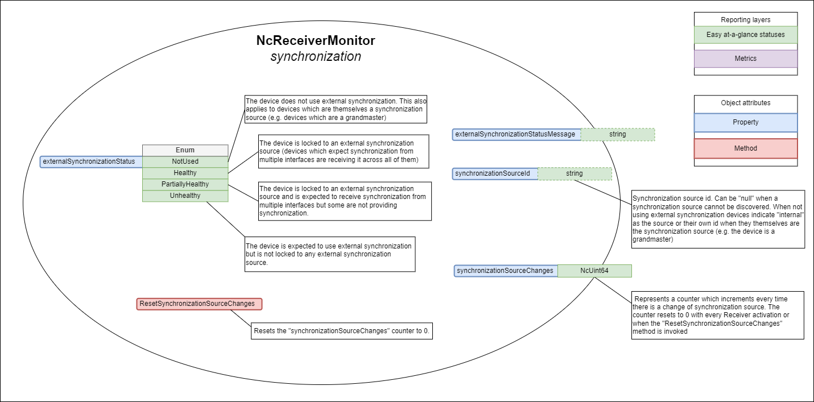

# AMWA BCP-008-01: Receiver status monitoring
{:.no_toc}

* A markdown unordered list which will be replaced with the ToC, excluding the "Contents header" from above
{:toc}

_(c) AMWA 2021, CC Attribution-NoDerivatives 4.0 International (CC BY-ND 4.0)_

## Introduction

The aim of this BCP document is to describe the expectations, behaviour and conformance requirements for Devices with stream Receivers in terms of status monitoring.

This document relies on previous familiarity with the following existing documents:

* [NMOS Control Framework](https://specs.amwa.tv/ms-05-02/)
* [NMOS Control Protocol](https://specs.amwa.tv/is-12/)
* [NMOS Discovery and Registration](https://specs.amwa.tv/is-04/)
* [NMOS Device Connection Management](https://specs.amwa.tv/is-05/)

The technical models referenced in this document are fully published in the [Monitoring NMOS Control Feature Set](https://specs.amwa.tv/nmos-control-feature-sets/branches/publish-status-reporting/monitoring/).

The following domains are covered in terms of status monitoring with specific sections for each:

* [Receiver connectivity](#receiver-connectivity)
* [Receiver synchronization](#receiver-synchronization)
* [Receiver stream validation](#receiver-stream-validation)

## Use of Normative Language

The key words "MUST", "MUST NOT", "REQUIRED", "SHALL", "SHALL NOT", "SHOULD", "SHOULD NOT", "RECOMMENDED", "MAY",
and "OPTIONAL" in this document are to be interpreted as described in [RFC-2119](https://datatracker.ietf.org/doc/html/rfc2119).

## Definitions

The NMOS terms 'Controller', 'Node', 'Source', 'Flow', 'Sender', 'Receiver' are used as defined in the [NMOS Glossary](https://specs.amwa.tv/nmos/main/docs/Glossary.html).

## Prerequisites

Devices in conformance to this BCP MUST use [NMOS Control Framework](https://specs.amwa.tv/ms-05-02/) for generating device models.  
Devices in conformance to this BCP MUST use [NMOS Control Protocol](https://specs.amwa.tv/is-12/) to expose device models via a standard API with full support for notifications.  
Devices in conformance to this BCP MUST use [NMOS Discovery and Registration](https://specs.amwa.tv/is-04/) to create and register Nodes, Devices and Receiver resources.  
Devices in conformance to this BCP MUST use [NMOS Device Connection Management](https://specs.amwa.tv/is-05/) to perform connection management actions against Receiver resources.  

## Receiver status

The technical model describing the monitoring requirements for a receiver is [NcReceiverMonitor](https://specs.amwa.tv/nmos-control-feature-sets/branches/publish-status-reporting/monitoring/#ncreceivermonitor).  The Receiver status is composed of an overall status and various `domain statuses` such as link status, connection status, synchronisation status and stream status.  These are described below.

The proposed models are minimal and they can be implemented as is or derived in [vendor specific variants](https://specs.amwa.tv/ms-05-02/latest/docs/Introduction.html) which can add more statuses, properties and methods.

|  |
|:--:|
| _**Receiver monitoring model**_ |

### Receiver overall status

This model MUST inherit from the baseline status monitoring model [NcStatusMonitor](https://specs.amwa.tv/nmos-control-feature-sets/branches/publish-status-reporting/monitoring/#ncstatusmonitor), which represents the overall status.

The purpose of the overall status is to abstract and combine the the domain statuses of a monitor into a single status which can be more easily observed and displayed by a simple client.

NcStatusMonitor consists of the `overallStatus` enumeration property and the `overallStatusMessage` string property.

The following recommendations are in place when mapping specific domain statuses into the `overallStatus` enumeration property:

* Inactive/Not used states are neutral and do no affect the overall status
* The overall status takes the worst state across the different domains (if one status is PartiallyHealthy (or equivalent) and another is Unhealthy (or equivalent) then the overall status would be Unhealthy)
* The overall status is Healthy only when all domain statuses are either Healthy or a neutral state (Inactive/Not used)

It is good practice is to populate the `overallStatusMessage` property with details of the "worst status" causing the current value of the overall status.  For statuses causing the current value of the overall status, a link status is considered a worst status than a connection status, which is considered a worst status than a synchronisation status, which is in turn considered a worst status than a stream status.

`Note`: The `overallStatus` might remain the same even when specific domain statuses change but the overall status message might change because a different combination of internal states is causing the current overall status value.

### Receiver connectivity

The connectivity domain statuses of [NcReceiverMonitor](https://specs.amwa.tv/nmos-control-feature-sets/branches/publish-status-reporting/monitoring/#ncreceivermonitor) are as follows:

* Properties
  * linkStatus
  * linkStatusMessage
  * connectionStatus
  * connectionStatusMessage
* Methods
  * GetLostPackets
  * GetLatePackets
  * ResetPacketCounters

|  |
|:--:|
| _**Receiver connectivity**_ |

#### Link status monitoring

Link status monitoring allows devices to expose the health of all the physical links associated with the receiver.

Devices specify if:

(*Reordered to be consistent with healthiest at the top - I think Jonathan proposed this*)
* AllUp - All of the interfaces are Up (equivalent to a Healthy state)
* SomeDown - Some of the interfaces are Down (equivalent to a PartiallyHealthy state)
* AllDown - All interfaces are Down (equivalent to an Unhealthy state)

The `linkStatusMessage` is an optional nullable property where devices can offer the reason and further details as to why the current status value was chosen.

#### Connection status monitoring

Connection status monitoring allows devices to expose the health of the receiver with regards to receiving stream packets successfully.

`Note`: Other connection problems like 802.1x authorization, DHCP and other causes are also reflected in the connection status.

The `connectionStatus` property has the following enumeration values:

* Inactive - The receiver is Inactive (is a neutral state)
* Healthy - The receiver is Active and receiving packets without using any form of loss recovery
* PartiallyHealthy - The receiver is Active and is receiving packets but some form of loss recovery is being used (e.g. redundant leg recovery or some form of FEC)
* Unhealthy - The receiver is active and is either not receiving any packets or receiving packets but has unrecoverable errors

The `connectionStatusMessage` is an optional nullable string property where devices can offer the reason and further details as to why the current status value was chosen.

#### Late and lost packets

The receiver monitoring model provides means of gathering metrics around late and lost stream packets. These are not statuses but instead enable further analysis when [link status](#link-status-monitoring) or [connection status](#connection-status-monitoring) indicate problems.

The feature is expressed with the following methods:

* GetLostPackets - returns a numeric value of the lost packets
* GetLatePackets - returns a numeric value of the late packets
* ResetPacketCounters - allows a client application to reset both the Lost and Late packet counters to 0.

### Receiver synchronization

The synchronization domain statuses of [NcReceiverMonitor](https://specs.amwa.tv/nmos-control-feature-sets/branches/publish-status-reporting/monitoring/#ncreceivermonitor) are as follows:

* Properties
  * synchronizationStatus
  * synchronizationStatusMessage
  * grandMasterClockId

|  |
|:--:|
| _**Receiver synchronization**_ |

#### Synchronization status monitoring

Synchronization status monitoring allows devices to expose the health of the receiver with regards to its time synchronization mechanisms.

Devices specify:

(*I think the text from the diagrams should be placed in these bullets (and expanded if necessary) as it feels more 'normative'*)
* NotUsed - the receiver is not using external synchronization (is a neutral state)
* BasebandLocked - the receiver is baseband locked (is equivalent to a Healthy state)
* BasebandPartiallyLocked - the receiver is partially baseband locked (is equivalent to a PartiallyHealthy state)
* NetworkLocked - the receiver is network locked (is equivalent to a Healthy state)
* NetworkPartiallyLocked - the receiver is partially network locked (is equivalent to a PartiallyHealthy state)
* NotLocked - the receiver is not locked to any timing source (is equivalent to an Unhealthy state)

The synchronization status message is an optional nullable property where devices can offer the reason and further details as to why the current status value was chosen.

#### Grandmaster change

When devices are configured to use network synchronization they MUST publish the grandmaster clock id currently being used and update the property whenever it changes. For devices which are not using network synchronization this property MUST be set to `null`.

### Receiver stream validation

The stream validation domain statuses of [NcReceiverMonitor](https://specs.amwa.tv/nmos-control-feature-sets/branches/publish-status-reporting/monitoring/#ncreceivermonitor) are as follows:

* Properties
  * streamStatus
  * streamStatusMessage

|  |
|:--:|
| _**Receiver stream validation**_ |

#### Stream status monitoring

Stream status monitoring allows devices to expose the health of the receiver with regards to the validity of the stream being received.

Devices specify:

* Inactive - when the receiver is inactive (is a neutral state)
* Healthy - the receiver is Active and can decode the incoming stream without any errors
* PartiallyHealthy - the receiver is Active and can decode the incoming stream but there are inconsistencies in the stream with what the device is expecting
* Unhealthy - the receiver is active and cannot decode the incoming stream

The `streamStatusMessage` is an optional nullable property where devices can offer the reason and further details as to why the current status value was chosen.
