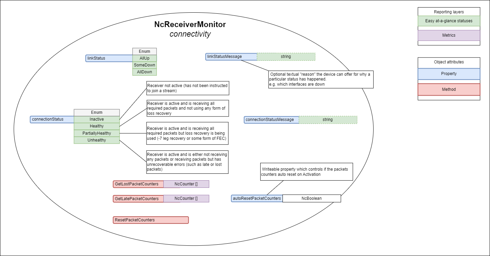

# AMWA BCP-008-01: Receiver status monitoring
{:.no_toc}

* A markdown unordered list which will be replaced with the ToC, excluding the "Contents header" from above
{:toc}

_(c) AMWA 2021, CC Attribution-NoDerivatives 4.0 International (CC BY-ND 4.0)_


## Introduction

Alarms are context and workflow specific, and in general determined by a higher level monitoring system, with different calculations for different users. For example, a hardware error status (such as link down) from a device not actively being used would not cause an alarm to a live workflow operator, but the same status condition would escalate an alarm to a maintenance engineer who needs to prepare that device for future operational use.

This BCP document does not attempt to define alarms but instead it describes the expectations, behavior and conformance requirements for Devices with stream Receivers in terms of status monitoring.

The [overall status](#receiver-overall-status) concepts defined in this document are intended to make it easy to calculate a typical operator alarm condition. In simple systems with no higher level monitoring system, the `overallStatus` can be used directly as a simple pre-defined non-configurable operator alarm condition, without in any way limiting a monitoring system's ability to take the same status values and calculate one or more different alarm conditions appropriate to other desired workflows or users.

This document relies on previous familiarity with the following existing documents:

* [NMOS Control Framework](https://specs.amwa.tv/ms-05-02/)
* [NMOS Control Protocol](https://specs.amwa.tv/is-12/)
* [NMOS Discovery and Registration](https://specs.amwa.tv/is-04/)
* [NMOS Device Connection Management](https://specs.amwa.tv/is-05/)

The technical models referenced in this document are fully published in the [Monitoring NMOS Control Feature Set](https://specs.amwa.tv/nmos-control-feature-sets/branches/publish-status-reporting/monitoring/).

The following domains are covered in terms of status monitoring with specific sections for each:

* [Receiver connectivity](#receiver-connectivity)
* [Receiver synchronization](#receiver-synchronization)
* [Receiver stream validation](#receiver-stream-validation)

## Use of Normative Language

The key words "MUST", "MUST NOT", "REQUIRED", "SHALL", "SHALL NOT", "SHOULD", "SHOULD NOT", "RECOMMENDED", "MAY",
and "OPTIONAL" in this document are to be interpreted as described in [RFC-2119](https://datatracker.ietf.org/doc/html/rfc2119).

## Definitions

The NMOS terms 'Controller', 'Node', 'Source', 'Flow', 'Sender', 'Receiver' are used as defined in the [NMOS Glossary](https://specs.amwa.tv/nmos/main/docs/Glossary.html).

Receiver activation - An [IS-05 activation](https://specs.amwa.tv/is-05/latest/docs/Interoperability_-_IS-04.html#identifying-active-connections) which results in the Receiver having the required transport parameters and a `master_enable` status of `true`. This can happen for an idle receiver but also when the receiver is already activated and a client is applying new transport parameters.

## Prerequisites

Devices in conformance to this BCP MUST use [NMOS Control Framework](https://specs.amwa.tv/ms-05-02/) for generating device models.  
Devices in conformance to this BCP MUST use [NMOS Control Protocol](https://specs.amwa.tv/is-12/) to expose device models via a standard API with full support for notifications.  
Devices in conformance to this BCP MUST use [NMOS Discovery and Registration](https://specs.amwa.tv/is-04/) to create and register Nodes, Devices and Receiver resources.  
Devices in conformance to this BCP MUST use [NMOS Device Connection Management](https://specs.amwa.tv/is-05/) to perform connection management actions against Receiver resources.  

## Receiver monitoring

The technical model describing the monitoring requirements for a receiver is [NcReceiverMonitor](https://specs.amwa.tv/nmos-control-feature-sets/branches/publish-status-reporting/monitoring/#ncreceivermonitor).

This model MUST inherit from the baseline status monitoring model [NcStatusMonitor](https://specs.amwa.tv/nmos-control-feature-sets/branches/publish-status-reporting/monitoring/#ncstatusmonitor)

The proposed models are minimal and they can be implemented as is or derived in [vendor specific variants](https://specs.amwa.tv/ms-05-02/latest/docs/Introduction.html) which can add more statuses, properties and methods.

|  |
|:--:|
| _**Receiver monitoring model**_ |

The `statusReportingDelay` property allows clients to customize the reporting delay used by devices to report statuses. Devices MUST use 3s as the default value. All domain specific statuses are impacted by the configured `statusReportingDelay` as follows:

* A receiver is expected to go through a period of instability upon activation. Therefore, on Receiver activation domain specific statuses offering an `Inactive` option MUST transition immediately to the Healthy state. Furthermore, after activation they MUST delay the reporting of non Healthy states for the duration specified by `statusReportingDelay`, as long as the Receiver isn't being [deactivated](#deactivating-a-receiver), and then transition to any other appropriate state.

* Once any Receiver activation `statusReportingDelay` has elapsed and the Receiver isn't being [deactivated](#deactivating-a-receiver), all domain specific statuses MUST delay the transition to a more healthy state by the configured `statusReportingDelay` value and MUST only make the transition if the healthier state is maintained for the duration. All domain specific statuses MUST make a transition to a less healthy state as soon as possible.

### Receiver overall status

The purpose of the overallStatus is to abstract and combine the specific domain statuses of a monitor into a single status which can be more easily observed and displayed by a simple client.

`Note`: The overallStatus might remain the same even when specific domain statuses change but the overallStatusMessage might change because a different combination of internal states is causing the current overallStatus value.

Devices MUST follow the rules listed below when mapping specific domain statuses in the combined overallStatus:

* When the Receiver is Inactive the overallStatus uses the Inactive option
* When the Receiver is Active the overallStatus takes the worst state across the different domains (if one status is PartiallyHealthy (or equivalent) and another is Unhealthy (or equivalent) then the overallStatus would be Unhealthy)
* The overallStatus is Healthy only when all domain statuses are either Healthy or a neutral state (e.g. Not used)

### Receiver connectivity

The technical model describing the monitoring requirements for a receiver is [NcReceiverMonitor](https://specs.amwa.tv/nmos-control-feature-sets/branches/publish-status-reporting/monitoring/#ncreceivermonitor).  
This includes the following specific items which cover the connectivity domain:

* Properties
  * linkStatus
  * linkStatusMessage
  * connectionStatus
  * connectionStatusMessage
  * autoResetPacketCounters
* Methods
  * GetLostPackets
  * GetLatePackets
  * ResetPacketCounters

|  |
|:--:|
| _**Receiver connectivity (explanatory notes are informative)**_ |

#### Link status

The linkStatus property allows devices to expose the health of all the physical links associated with the receiver.

Devices specify if:

* All of the interfaces are Up (equivalent to a Healthy state)
* Some of the interfaces are Down (equivalent to a PartiallyHealthy state)
* All interfaces are Down (equivalent to an Unhealthy state)

The linkStatusMessage is a nullable property where devices can offer the reason and further details as to why the current status value was chosen.

Devices are RECOMMENDED to publish information about which interfaces are down in the linkStatusMessage.

Example:

```log
NIC1, NIC2 are down
```

#### Connection status

The connectionStatus property allows devices to expose the health of the receiver with regards to receiving stream packets successfully. Other connection problems like 802.1x authorization, DHCP and other causes are also reflected in the connectionStatus.

Devices specify:

* When the receiver is Inactive (is a neutral state)
* Healthy when the receiver is Active and receiving all required packets without using any form of loss recovery
* PartiallyHealthy when the receiver is Active and is receiving all required packets but some form of loss recovery is being used (e.g. redundant leg recovery or some form of FEC)
* Unhealthy when the receiver is Active and is either not receiving any packets or receiving packets but has unrecoverable errors (such as late or lost packets)

The connectionStatusMessage is a nullable property where devices can offer the reason and further details as to why the current status value was chosen.

#### Late and lost packets

The receiver monitoring model provides means of gathering metrics around late and lost stream packets. These are not statuses but instead enable further analysis when [link status](#link-status) or [connection status](#connection-status) indicate problems (are PartiallyHealthy or Unhealthy).

The feature is expressed with the following methods:

* GetLostPacketCounters - returns a collection of counters which hold the name, description and numeric value of the counter (this allows more capable devices to report lost packets across different interfaces).
* GetLatePacketCounters - returns a collection of counters which hold the name, description and numeric value of the counter (this allows more capable devices to report late packets across different interfaces).
* ResetPacketCounters - allows a client application to reset both the Lost and Late packet counters to 0.

The `autoResetPacketCounters` property allows clients to configure if the packet counters automatically reset with each Receiver activation (by default devices MUST have this enabled). If this is enabled, receivers MUST reset all packet counters to 0 after each activation.

### Receiver synchronization

The technical model describing the monitoring requirements for a receiver is [NcReceiverMonitor](https://specs.amwa.tv/nmos-control-feature-sets/branches/publish-status-reporting/monitoring/#ncreceivermonitor).  
This includes the following specific items which cover the synchronization domain:

* Properties
  * externalSynchronizationStatus
  * externalSynchronizationStatusMessage
  * synchronizationSourceId
  * synchronizationSourceChanges
* Methods
  * ResetSynchronizationSourceChanges

|  |
|:--:|
| _**Receiver synchronization (explanatory notes are informative)**_ |

#### External synchronization status

The externalSynchronizationStatus property allows devices to expose the health of the receiver with regards to its time synchronization mechanisms.

Devices MUST specify:

* Not used - when the receiver is not using external synchronization or when the device is itself the synchronization source (this is a neutral state)
* Healthy - when the receiver is locked to an external synchronization source (devices which expect synchronization from multiple interfaces are receiving it across all of them)
* Partially healthy - when the receiver is locked to an external synchronization source and is expected to receive synchronization from multiple interfaces but some are not providing synchronization (Receivers MUST also temporarily transition to this state when detecting a synchronization source change)
* Unhealthy - when the receiver is expected to use external synchronization but is not locked to any external synchronization source

The externalSynchronizationStatusMessage is a nullable property where devices can offer the reason and further details as to why the current status value was chosen.

Devices are recommended to publish information about the previous synchronization source and interface retrieved from as well as the current synchronization source and interface retrieved from in the externalSynchronizationStatusMessage.

Devices are RECOMMENDED to publish in the `externalSynchronizationStatusMessage` property information about the previous synchronization source and originating interface as well as the current synchronization source and its originating interface.

Example:

```log
previousSync:baseband from SDI1, currentSync: 0x00:0c:ec:ff:fe:0a:2b:a1 from NIC1
```

or

```log
previousSync:0x70:35:09:ff:fe:c7:da:00 from NIC1, currentSync: 0x00:0c:ec:ff:fe:0a:2b:a1 from NIC2
```

#### Synchronization source change

When devices are configured to use external synchronization they MUST publish the synchronization source id currently being used and update the `externalSynchronizationStatus` property whenever it changes, using `null` if a synchronization source cannot be discovered. Devices which are not using external synchronization MUST populate this property with `internal` or their own id if they themselves are the synchronization source (e.g. the device is a grandmaster).

When devices suffer a synchronization source change the `externalSynchronizationStatus` property MUST temporarily transition to a `PartiallyUnhealthy` state. It can then return to a different state if the operating conditions match it more closely (returning to a healthier state MUST respect the configured `statusReportingDelay` property).

Devices MUST report any synchronization source change as an increment to the `synchronizationSourceChanges` counter property.

Devices MUST be able to reset the `synchronizationSourceChanges` counter property in the following two ways:

* When a receiver activation occurs
* When a client invokes the `ResetSynchronizationSourceChanges` method

### Receiver stream validation

The technical model describing the monitoring requirements for a receiver is [NcReceiverMonitor](https://specs.amwa.tv/nmos-control-feature-sets/branches/publish-status-reporting/monitoring/#ncreceivermonitor).  
This includes the following specific items which cover the stream validation domain:

* Properties
  * streamStatus
  * streamStatusMessage

|  |
|:--:|
| _**Receiver stream validation (explanatory notes are informative)**_ |

#### Stream status

The streamStatus property allows devices to expose the health of the receiver with regards to the validity of the stream being received.

Devices specify:

* When the receiver is Inactive (is a neutral state)
* Healthy when the receiver is Active and can decode the incoming stream without any errors
* PartiallyHealthy when the receiver is Active and can decode the incoming stream but there are inconsistencies in the stream with what the device is expecting
* Unhealthy when the receiver is active and cannot decode the incoming stream

The streamStatusMessage is a nullable property where devices can offer the reason and further details as to why the current status value was chosen.

Examples:

```log
Unexpected stream format
```

```log
Payload ID in RTP stream does not match SDP file
```

```log
Parameter X does not match expectations
```

### Deactivating a receiver

A Receiver is deactivated after an [IS-05 activation](https://specs.amwa.tv/is-05/latest/docs/Interoperability_-_IS-04.html#identifying-active-connections) results in the Receiver `master_enable` becoming `false`.

When a receiver is being deactivated it MUST cleanly disconnect from the current stream by not generating intermediate unhealthy states (PartiallyHealthy or Unhealthy) and instead transition directly and immediately (without being delayed by the `statusReportingDelay`) to `Inactive` for the following statuses:

* overallStatus
* connectionStatus
* streamStatus
